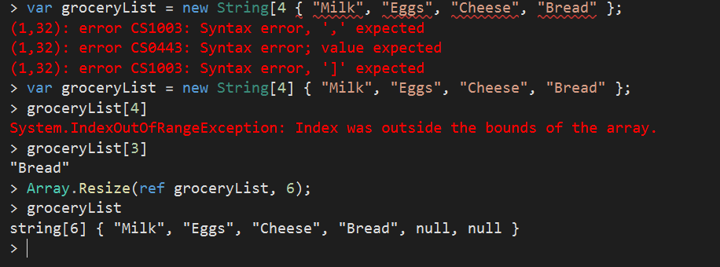
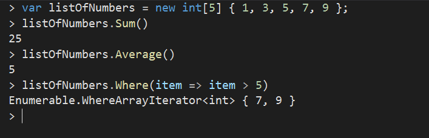
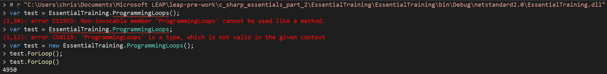

C# TRAINING ESSENTIALS PART 2:
FLOW CONTROL, ARRAYS, EXCEPTION HANDLING

A. Unit Testing and Test-Driven Development (TDD)

 - This is the foundation of Agile development.
 - In TDD, develop code in phases / features where you develop pieces of code to prove that it runs as designed.
 - Goal is to have 100% coverage, testing all exposed methods.
 - The test project must have a `reference` to the class it is testing as well as require it with `using` to be able to access all functionality.

B. Arrays & Collections

 - **Arrays** in C# are just like arrays in other languages, a collection of items (list) of the same type - strongly typed language.
 - They are a fixed length, where items are assigned based on position.

 

 - `ref` allows you to pass in an item by reference. Usually items are passed in by value, meaning the program makes a copy of the original item and muttates the copy. Passing by reference means the original item is actually mutated. 
 - Create a constructor for a class using the shortcut: `ctor` + `Tab` + `Tab`.
 - When testing a method, the test class must include the `[TestMethod]` decorator as a flag for the program to know to run the method.
 - For multidimensional arrays, instantiate an array using the number of rows as of the first argument and the number of items (columns) per row second as such:

    - `var multi = new String[2,3];`
    - `var multi = new int[2,3];`

 - Multidimensional arrays are great for analytical purposes, serving as a spreadsheet. 
 - **Lists** are part of a generic C# class called collections.
 - When you see `<>` appear after a class / method, that means that it is a generic, and you can pass in a type of class (even one created by you).
    - `var awesomeSauces = new List<string>();`
    - `awesomeSauces.add("Cholula");`
    - No need to declare a size here because it is dynamic and changes as you add items.
 - Language Intgrated Query (**LINQ**)
    - Executed as a set of extension classes.
    - Adds functionality into an exsiting class without altering the original class code or creating a sub-class.

 - **Dictionaries** use a key:value pair to assign a value to a designated variable / key. The types of both the key and the value must be declared when initialized.

    - `var dictionaryWords = new Dictionary<string, string>();`

 - Keys must be unique - no duplicates are allowed!

C. Flow Control

 - Control the flow of programming logic using `if` statements - this is the most basic way programmers control their logic. 
 - When taking in input from a user for comparing in logic statements, always remember to factor in capitalization (using `ToLower()` or `ToUpper()`).
 - Operators:
   - `=` --> Assignment operator
   - `==` --> Comparison operator
 - Comparing multiple items:
   - Use `if`, `else if`, `else` when comparing more than 2 items. 
   - Can also implement a `switch` statement when comparing multiple items with `cases`. A `break` is needed to signal the program to move onto the next case statement.
   - Compound statement using `||` for **_OR_** and `&&` for **_AND_**.
   - The **_NOT _** operator `!=`.
 - There are three types of loops we can use in C#:
   - `For Loop`, using `i` as the incrementer. The for loop has three main parts: the variable declaration, the break point condition, and the incrementing value. When declaring a method, if you do not want it to return anything, use the `void` keyword. If it will return something, the type must be declared when defining the method. 
   - `ForEach Loop`, used iterating over for IEnumerables (found in the `List` Collection)
   - `Do/While Loop` - use a `do` loop if you want your code to run at least once before checking its condition, but use a `while` loop if you potentially want to never run your block of code within the loop.
 - `break` and `continue` allow you to alter how a `loop` functions.
   - `continue` stops the current scope of programming code (one iteration within a loop)
   - `break` stops the entire looping iteration action
 - To run your project in the `C# Interactive` terminal, do the following:
   - Type `#r` + File URL + `Enter` in the terminal. Find the file URL by right-clicking on the Project in `Solution Explorer` and choosing `Open Folder in File Explorer`. Navigate to the `debug` directory.
   - Then call the `namespace` to check that all public classes are avaible. 
   - If access is incorrect, run `Rebuild` under the `Build` tab in the menu.

D. Exception Handling

 - A runtime exception is one that the compiler can't catch. 
 - Syntax errors will be raised as warnings by VSCode and the compiler will catch them. Pro-tip: if there's a series of Warnings in the console, check the first one and try to fix this one - it will usually clear the remaining warnings. 
 - Unit testing exists to prevent / catch runtime exceptions.
 - Code in a defensive way, try to catch exceptions / mistakes as you code --> `try` and `catch`:
   - `try` keyword will attempt to execute all the statements within its block.
   - `catch` keyword will run if a section of the code in the `try` block does not successfully execute. Pass the Error Name in as the argument to this.
      - `catch (System.IO.DirectoryNotFoundException ex)`
      - `catch (Exception ex)`
   - `using` block can be implemented to read from a file.
      - Need to add `using System.IO` to use file reading methods.
      - Pass in a new instance of the `StreamReader` class.
      - `StreamReader` takes an argument of the file path in `""`. Be careful with the `\` because this triggers a break point (escape character), so either use a `@` before the file path or use `\\` in place of the `\`.
   -  Great for testing database or network connections to be sure that all connections are accounted for and closed.
 - `IDisposable interface` is used for things built using external resources (connecting to databases / reading files) for garbage collection.

E. Getting to Production

 - Before taking an application to production, write a logging package.
   - PyPy for Python
   - NPM for Node.js
   - NuGet for .NET
 - NLog
   - Use this to log output, can be used to distinguish between production and development phases.
   - `Trace` is the lowest && `Fatal` is the highest.
   - These log to a log file NOT the console (which is the purpose of WriteLine)
   - You will need to go into the NLog config file to add targets and rules (some are already included and just commented out right off the bat).
 - When compiling in `Debug`, there are efficiency differences when compared to compiling in `Release` mode. So when running for personal testing purposes, run in `Debug` mode, but for production, change it to `Release`. The Releease mode requires a specific `.NET` runtime.
